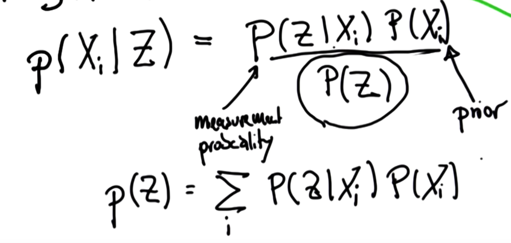
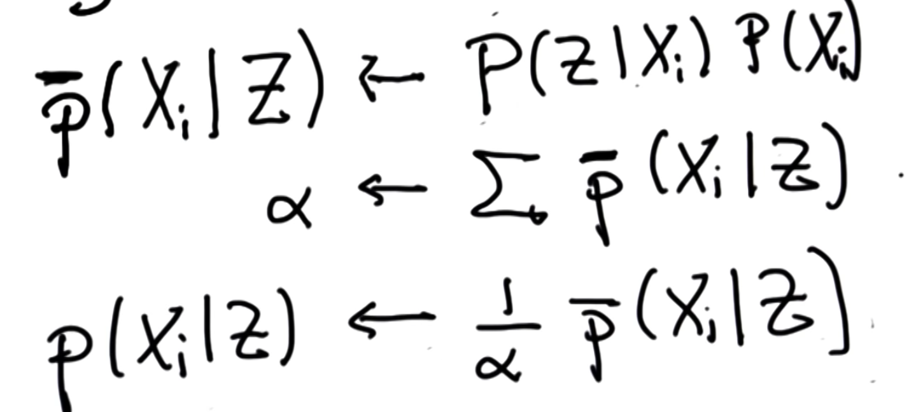
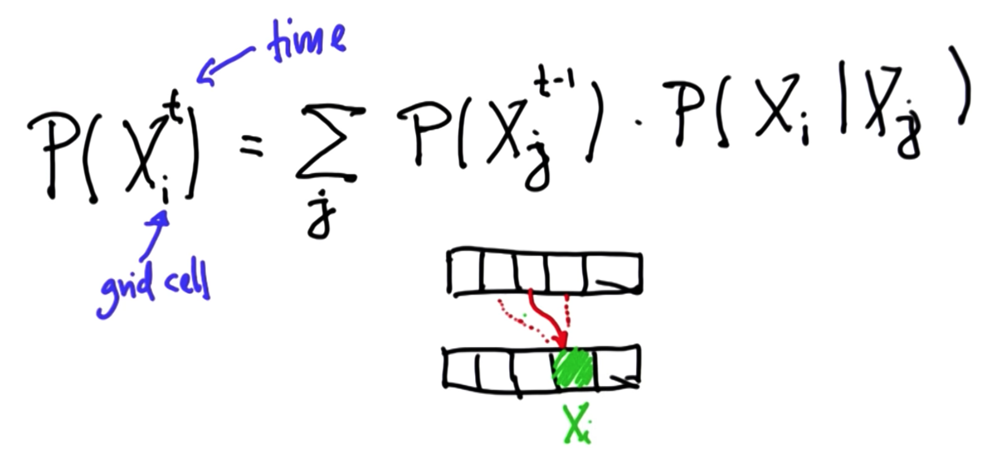
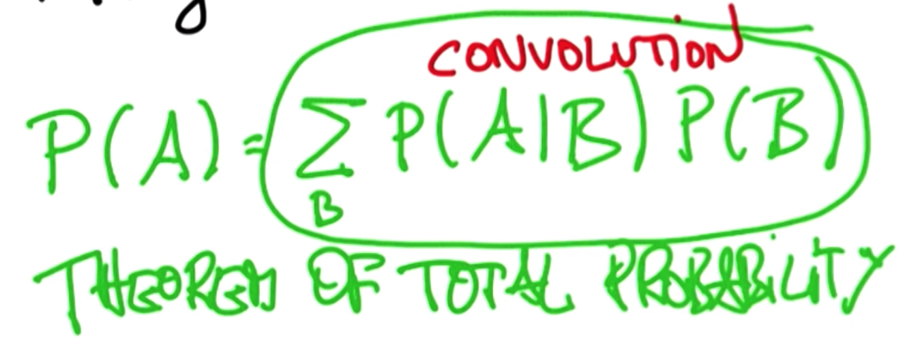

## Localization summary

Belief = Probability
Sense = Product followed by normalization
Move (Motion) = Convolution (addition)

Condition for probability distribution
- 0 <= P(X) <= 1
- Sum(P(Xi)) = 1

#### Bayes Rule

#### Total Probability

Motion - Total Probability

i = posterior   
j = prior

Theorem of Total Probability   

